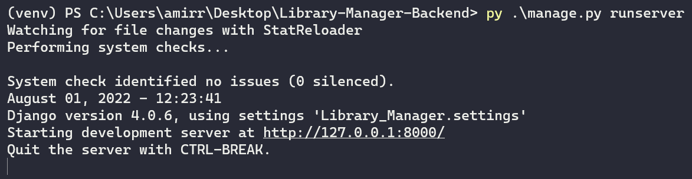

# README

# Library-Manager-Backend

Back-end part of an app--written with Django-responsible for managing the variety of activities that take place in a library.

## Introduction

This repository is responsible for the Back-end part of the Library Manager application. I formulated daily processes of libraries in this manner:

This application should have 2 user types. **Admin-user** which is responsible for the management of books, memberships, and borrowing books. **Guest-user** which gives non-staff individuals the ability to search through the database for books. This search can be based on author, book’s name, and its publication.

## Required Applications

- PostgreSQL

## How to Use

First, install the required packages

```markdown
py install -r requirements.txt
```

Then, create a database in pgadmin4 and name it **Library_Manager**. After creating the database, you should restore the back-up file in the Database folder. 

After that run the following commands in your terminal.

```markdown
py manage.py migrate
py manage.py runserver
```

Finally, you will be able to see that the server is now running on **127.0.0.1:8000**



On your browser open the mentioned address. You will see the API Root of the project. From here you can access all the available URLs in the Backend of the project. In each URL, you will be able to view, create, and delete rows.


## Full Project

To be able to use the application in the practical settings, you need to install the  [Library-Manager-Frontend](https://github.com/amirrezasokhankhosh/Library-Manager-Frontend) as well. After that the whole application will look like the pictures below.


And, with search:


